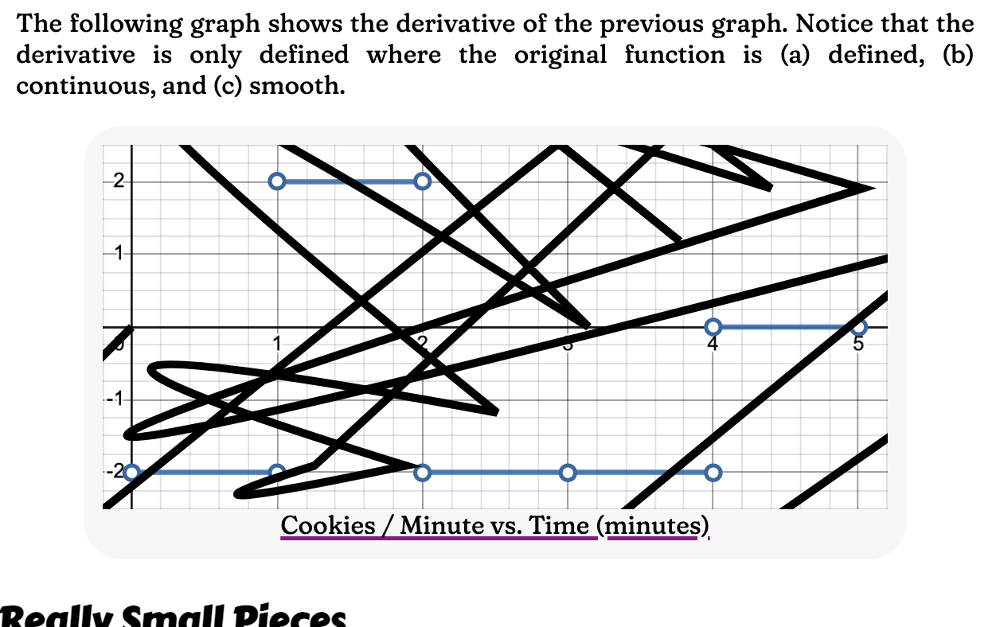
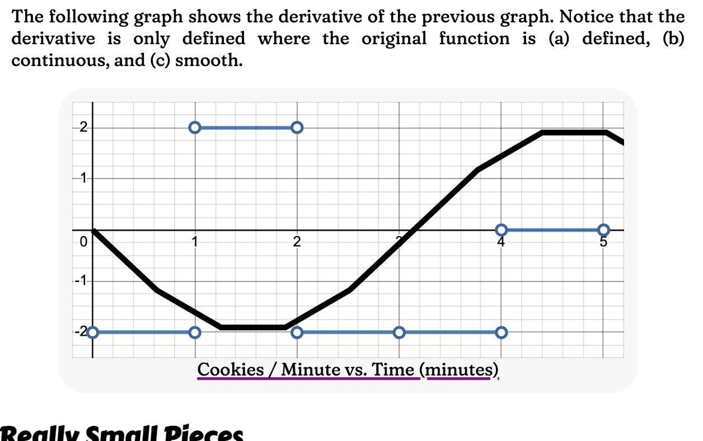
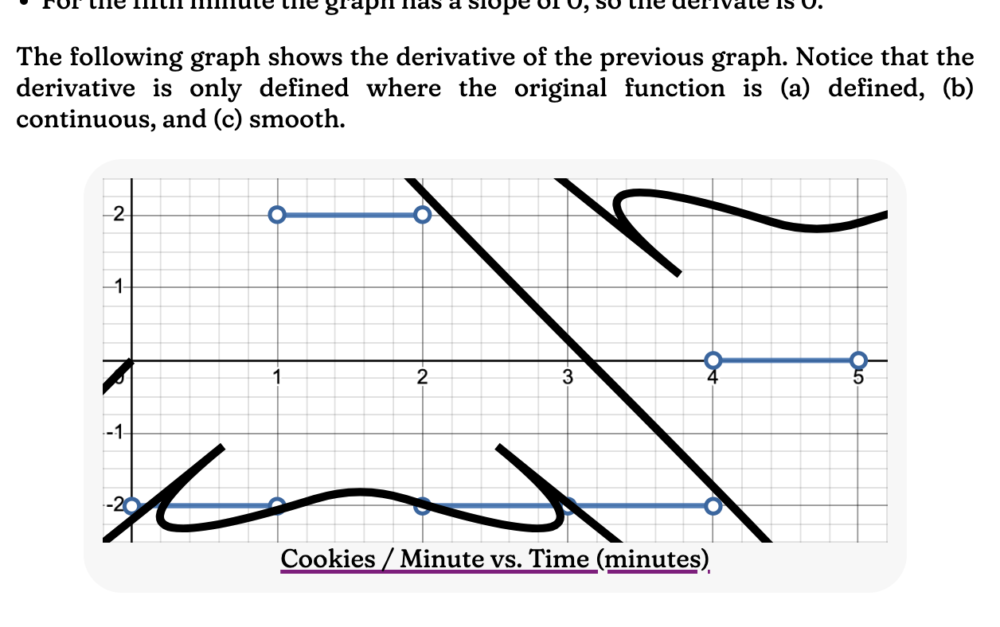
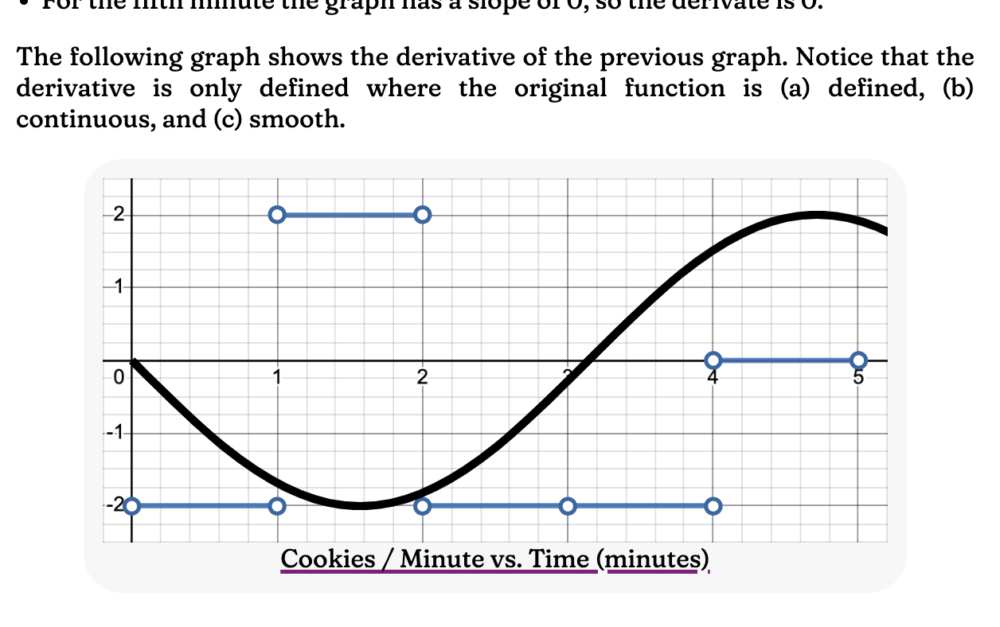
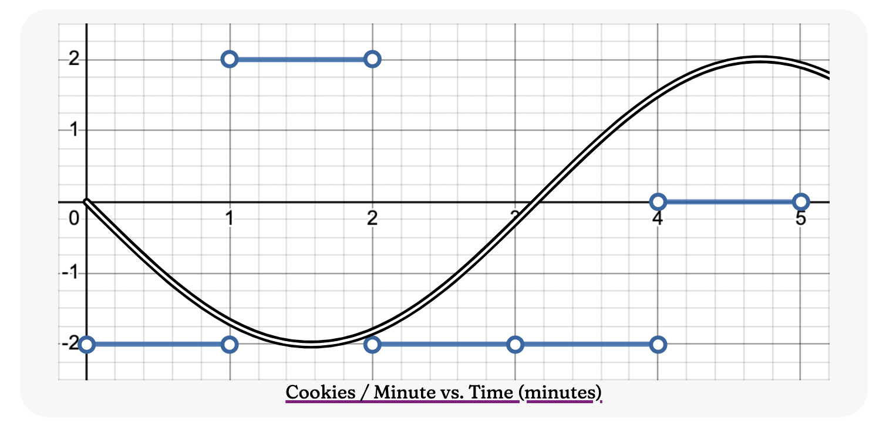
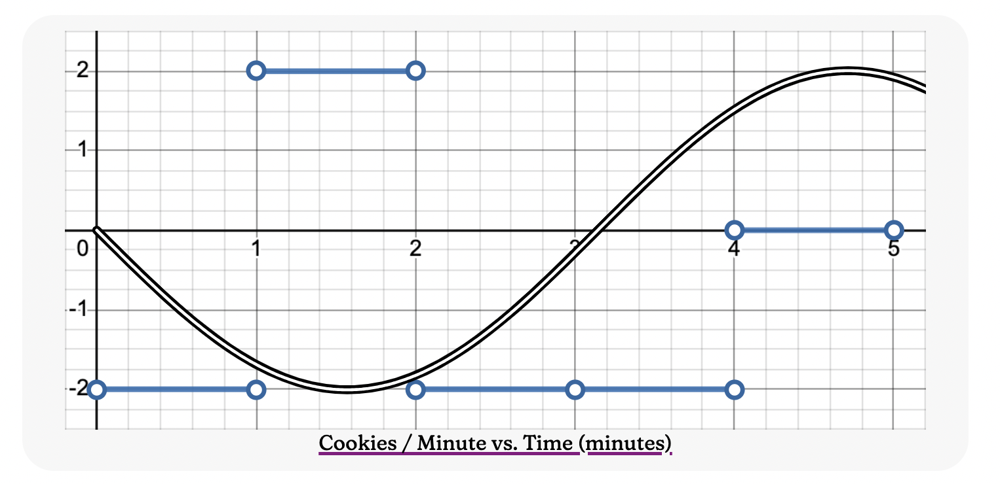
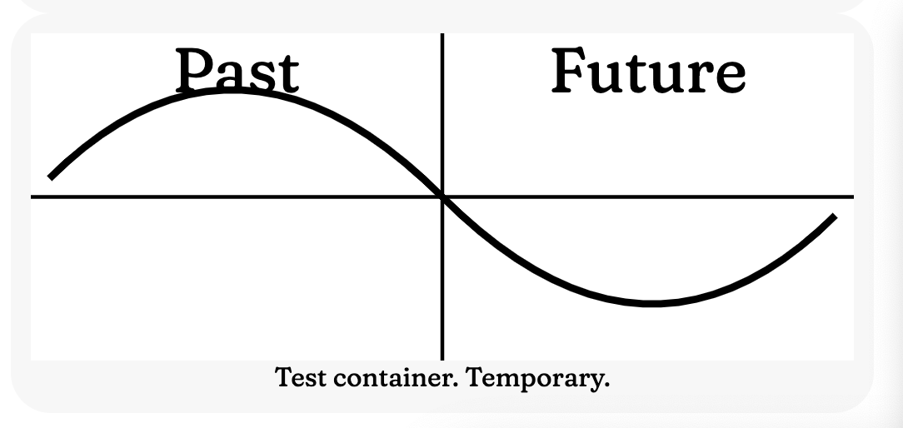
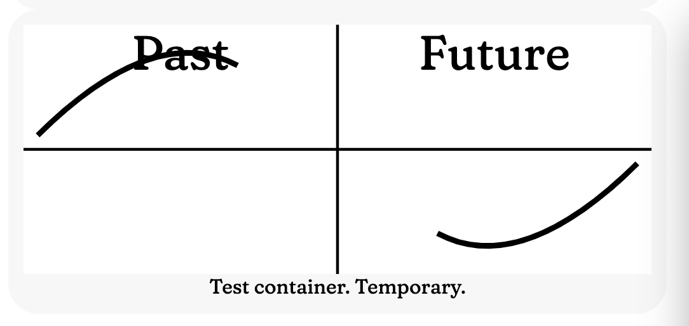
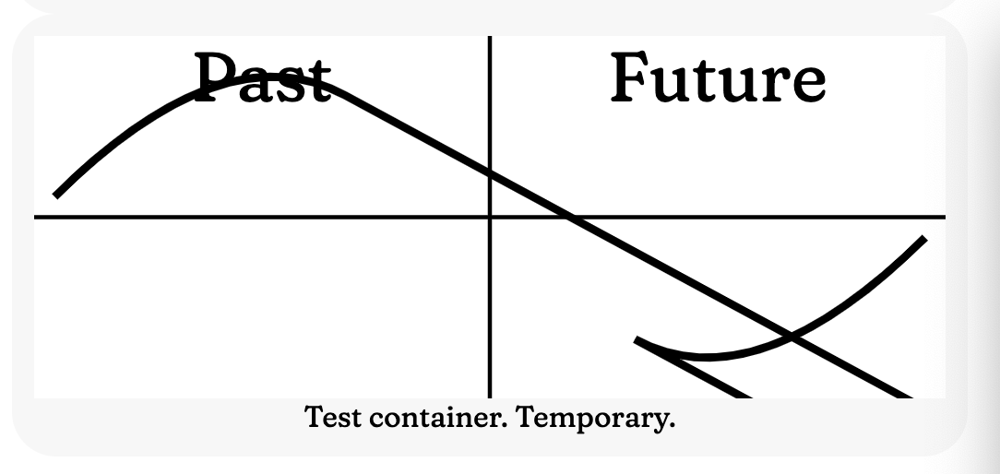

# Overview

[This document](https://tradeideasphilip.github.io/divide-by-zero/) is my entry in in the [#SoME3](https://3blue1brown.substack.com/p/some3-begins) contest.
This git repository shows you how I created the document.

# Video

These help document the status of this project.

- [Bribing ALL of the #SoME3 judges — How much would it cost?](https://www.youtube.com/watch?v=VnLQNXIJ1l4)
- [#some3 status update - interactive demo](https://www.youtube.com/shorts/RDkrc9fiNtw)
- [How to Divide by Zero #SoME3 progress and behind the scenes](https://youtu.be/h_LclJS3_Nw)
- [How many parabolas does it take to draw a sine wave? #SoME3](https://www.youtube.com/shorts/1-BKmXGkuEI)
- [Everything you need to know about calculus in 18 seconds #SoME3](https://www.youtube.com/shorts/CENmCTSuOb4)
- [Responsive Design — Perfecting my #SoME3 paper](https://youtube.com/shorts/EJIehm0q5YI)
- [#some3 submission: How to Divide by Zero and Other Spells You Will Learn in High School Calculus](https://youtu.be/4_YTVm9S-DQ)
- [Visualizing the Fundamental Theorem of Calculus](https://www.youtube.com/shorts/1j_tSvBpaBQ) ~~Coming Soon~~
- Visualizing the Derivative — [Coming Soon](https://www.youtube.com/@PhilipSmolen/shorts)
- Integration — Visualizing The Area Under the Curve — [Coming Soon](https://www.youtube.com/@PhilipSmolen/shorts)

Newest ones are on the bottom.

# The pictures

The backgrounds for most of my pictures come from Desmos.
This was the quickest, easiest way to graph a function.
And most of the pictures include a hyperlink back to the original Desmos graph, so the user can explore further without me.

I added my own annotations using SVG.
It was easy to scale the SVG so my annotations would match the original graph.
And I use TypeScript (JavaScript) to animate some of the SVGs and to allow user interaction.

My TypeScript code actually uses some interesting math.
If you like the math presented in this document, you'll find even more when you look behind the curtain!

My animated demos are taking a lot more time than the words.
But I _really_ like the results, so I'm going to keep going.

## Problem

In Desmos I'm having trouble showing undefined points.
https://cl.desmos.com/t/in-the-grarh-ui-show-undefined-points/3904/2
If I drag my mouse, Desmos will show the correct value at each place, including "(0, undefined)" where x=0.
But that's easy to miss.
Normally you'd draw a big open circle at that point.
I've tried a few things and nothing has worked well in Desmos.

## Parabolas in SVG

I wasn't having much luck with other approaches, so I decided to draw some things in SVG.
SVG gives high quality results.
And it knows how to draw parabolas!

The problem is that SVG uses a different format for specifying parabolas than we use in algebra and calculus.
I couldn't find a good reference on the subject, so here's what I discovered by trial and error.

<svg
  style="height: 400px; width: 400px; background-color: antiquewhite"
  viewBox="-5 -5 10 10"
  xmlns="http://www.w3.org/2000/svg"
  stroke-width="0.1"
  transform="scale(1 -1)">
<g id="grid" stroke-width="0.05" fill="none" stroke="lightgray">
<path d="M -5,-4 H 5"></path>
<path d="M -5,-3 H 5"></path>
<path d="M -5,-2 H 5"></path>
<path d="M -5,-1 H 5"></path>
<path d="M -5,1 H 5"></path>
<path d="M -5,2 H 5"></path>
<path d="M -5,3 H 5"></path>
<path d="M -5,4 H 5"></path>
<path d="M -4,-5 V 5"></path>
<path d="M -3,-5 V 5"></path>
<path d="M -2,-5 V 5"></path>
<path d="M -1,-5 V 5"></path>
<path d="M 1,-5 V 5"></path>
<path d="M 2,-5 V 5"></path>
<path d="M 3,-5 V 5"></path>
<path d="M 4,-5 V 5"></path>
<path stroke="black" d="M -5,0 L 5,0 M 0,-5 0,5"></path>
</g>
<g fill="orange">
<circle id="startingPoint" cx="-2" cy="4" r="0.2"></circle>
<circle id="endingPoint" cx="2" cy="4" r="0.2"></circle>
<circle id="controlPoint" cx="0" cy="-4" r="0.2" fill="violet"></circle>
</g>
<g id="tangentLines" fill="none" stroke="blue">
<path d="M -3,8 L 1,-8"><!--  y = -4x - 4  --></path>
<path d="M 3,8 L -1,-8"><!--  y = 4x - 4  --></path>
</g>
<path
    id="parabola"
    fill="none"
    stroke="lime"
    d="M -2,4 Q 0,-4 2,4">
</path>
</svg>

[Sample SVG Graphic](./readme-images/parabola.svg)

I have to specify a starting and ending point.
These are shown here as orange circles.
In the real presentation I will put these at the edge of the image, or slightly past the edge.
In this example I put all the points well inside the image, to help me find any problems.

Finally I need a _control point_, shown here as a violet circle.
I had to do a little math to compute that, but not much.
I need to draw a line that goes through the starting point and is tangent to the parabola.
(That requires very simple calculus, just the derivative of the parabola.)
And a second tangent line through the ending point.
Where those two lines cross, that's the control point.

`<path id="parabola" fill="none" stroke="lime" d="M -2,4 Q 0,-4 2,4"></path>` draws the actual parabola.
Notice the three sets of coordinates describing the start, control, and end points.
The `Q` means "quadratic."
See the source code for more details.

Of course I'm not going to draw the circles or tangent lines in my final presentation.
Those only exist as math behind the scenes.

GitHub stripped the `<svg>` tags from my markdown.
So I will still need to make my own HTML file for my presentation.
That will also allow me to add some simple animations, and possibly some user interaction.

# Sample Problem Solving

These pictures show my progress solving a specific problem. I'm trying to draw a sine wave in SVG. Previously I've relied on Desmos to plot functions.

I find it interesting to follow the progress as I worked on one problem after the next.
This particular feature is a pretty random example.
It's pretty visual, so I took pictures.

See my first try, below.
I'd been working for a while.
When I finally got a graph to show up, this is the first thing I saw.

It looks like it was drawn by a three year old!
And I feel a strange urge to print it out and hang it on my refrigerator.

Ignore the cookies per square minute stuff in blue.
I was just reusing an existing graph for a quick and dirty test.
The thick black line was my first — and most entertaining — attempt at a sine wave.

For this next test I disabled the curves.
At first I thought there was a problem with the 11 points between the curves.

As soon as I plotted these 10 line segments it was obvious that these points were correct, and the curves were the problem.

I found the horizontal segments the most interesting.
They are so close to the grid lines.
The curve will have to make contact with the grid lines.

That chart helped me find a bug.
I made a mistake in a simple algebra problem.
That lead to this next image.

This is an improvement from the initial picture.
It's so much more artistic!

And from here I could guess what the next problem was.
And, as the next image shows, my guess was correct.

I forgot a negative sign in a derivative!

That last one _looks_ good, but is it correct?

I created a second path with more data points and less interpolation.
As you can see in the next image, it all looks good.

All three curves should be the same width.

The image above looks pretty good.
I wanted to be sure.
The the thick black line above comes from 10 segments.
The image below is the same but the black line came from 14 segments.

Is this better than the previous test?

I don't know.
When I looked closely they look similar.
I could do some work and try to flip between them.
Or I could just say the first one is good enough.
I will be showing multiple sine waves, and I will be updating each one once per animation frame.
And I have other things to do.

# More Fun Progress

I was chasing down an interesting bug.
I created some very simple test cases, shown here.

This first picture shows what happens when you try to draw a sine wave with only two parabolas.

It actually does a halfway decent looking job, as long as you line up the parabolas right.

Next is what happens when you try to draw the same curve with exactly three parabolas.

First notice that curve goes a lot higher than last time.
I'm pushing this algorithm to its limits in this test, so I won't vouch for its accuracy.

And, of course, there's the big hole in the middle of this sine wave.

The segment we're trying to draw is sort'a s-shaped, so it's not a good match for my algorithm.
My code divided by zero.
I skipped the segment and moved on.

Then I finally did the right test.
I asked the computer to shave 0.01 off the right side of the sine wave, and here's what it gave me.

My adjustment was two small too see any changes on the two end pieces.
But what's happening with those other two lines?
Lines like this were popping up in my animations, causing flicker.
**This** is the bug I've been looking for; I finally captured it!

Notice how the two weird lines are almost parallel.
Each time I create a new segment I start by getting the tangent lines for the endpoints of the segment.
Then I compute the point where those two tangent lines cross.
Those two spurious lines are the tangent lines.
And they are almost parallel, so they meet way off the screen.

When the two lines were exactly parallel, the formula divided by 0, as if trying to get to infinity and it was obvious that there was a problem.
That's why the previous picture has a hole in it.

But this time the computer tried to divide by something _close to_ 0, and that resulted in a point _close to_ infinity.
So I drew crazy things on the screen.

Notice how the longer line actually lines up with the previous curve perfectly.
But the shorter line goes 180° in the wrong direction.
That's the bug.
My code asked where two _lines_ would cross.
In fact I wanted to know where two _rays_ would cross.
(Ray = ½ Line)
In this case the correct answer should have been "nowhere."

Now my code catches all of the bad cases like this.
If it can't do anything better, the the code now just draws a straight line between the endpoints.

Watch [How many parabolas does it take to draw a sine wave?](https://www.youtube.com/shorts/1-BKmXGkuEI) for more.
After fixing the bug I show a moving sine wave with way too few segments.

# How to build

The deliverable is [my animated document](https://tradeideasphilip.github.io/divide-by-zero/), which has already been built for you. The rest of this git repository is available for people who want to know more, and maybe try something similar themselves.

I wrote some [instructions](https://github.com/TradeIdeasPhilip/bounce-3d#starting-from-scratch) for reproducing my build environment.

Most of the time I'm running in VS Code and the Vite extension automatically starts the dev mode script for me. I hit ⌘S to save my changes and my browser automatically refreshes. I type `npm run build` before I push to github.

# Document vs. Video

I like my decision to make a document.

Last year I made a [video](https://www.youtube.com/watch?v=aZTTa00VEcQ).
I like the result.
But I think I get more results for my effort in the document.

With the document I can fret over every detail.
I can easily make small changes.
With the video I was often afraid to make some small changes because I'd have to redo so much work.

Also, with the video I was never sure of the right pace.
With a document people can reread a tough section, and skim past the stuff they already know.

# How to Make Animations Like This

I really liked the results of this project.
You can see how I made these animations, and you can see my previous projects, all on GitHub.

But I really wish I'd seen this much sooner.
https://developer.mozilla.org/en-US/docs/Web/API/Web_Animations_API
If you know JavaScript, and you want anything more than the simplest animation, consider this over CSS.

# Other People's Work

The monitor that I use in some thumbnails comes from https://en.wikipedia.org/wiki/Computer_monitor#/media/File:MonitorLCDlcd.svg. Attribution: Михајло Анђелковић (original picture), modification: Mielon, CC BY-SA 3.0 <https://creativecommons.org/licenses/by-sa/3.0>, via Wikimedia Commons

Click on pictures of the Mandelbrot set, “How long in the coast of Britain,” and the formal definition of a limit to see where they come from and to learn more about those subjects.

My animation of an LC circuit is based on a drawing from Wikipedia. Click on that circuit to find the original and to learn more about LC circuits.
